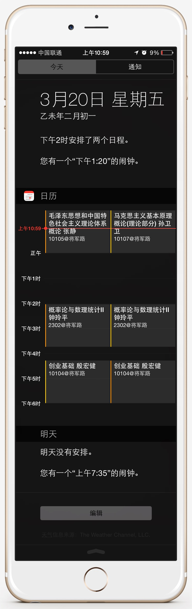
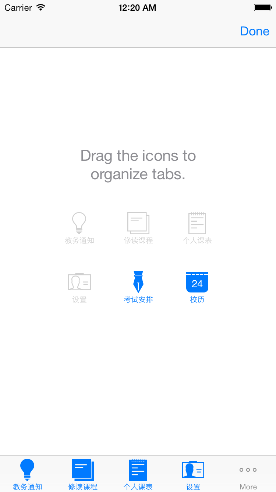
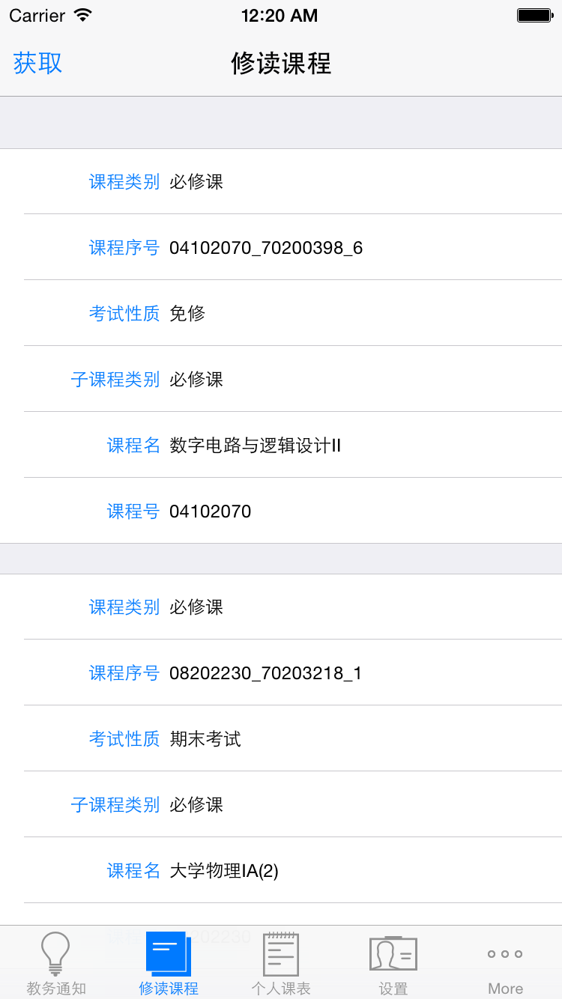
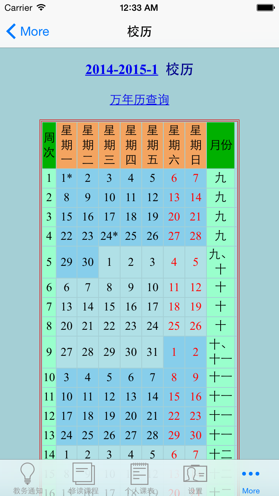
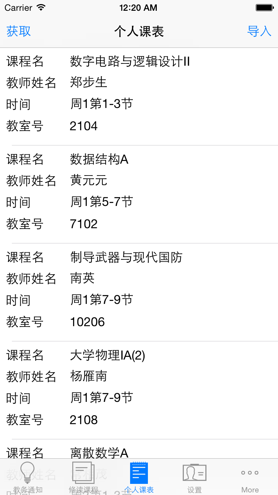
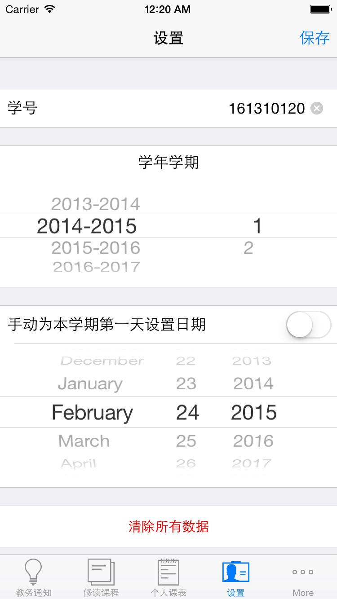
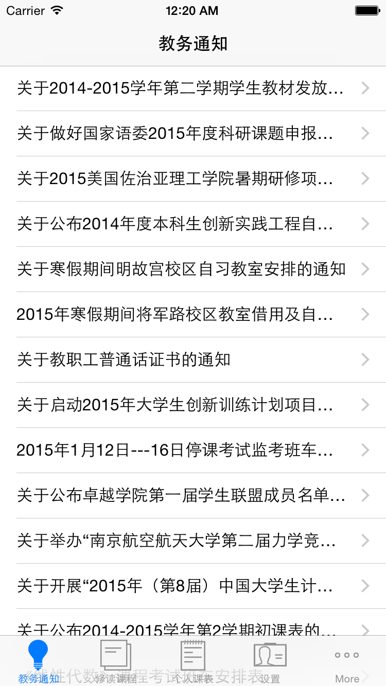
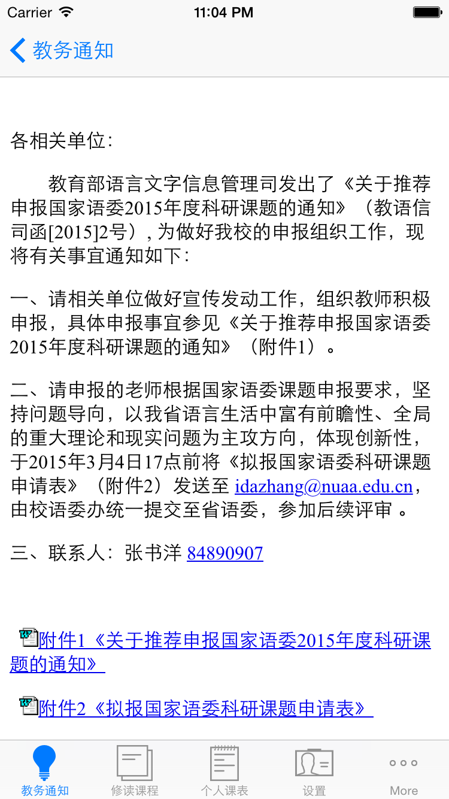
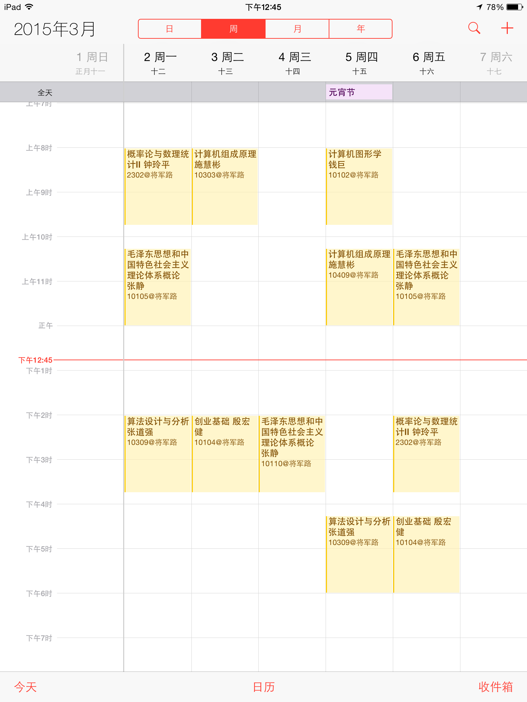

## 砚湖畔
The Missing NUAA Class Schedule Utility for iOS

已经上架到APPStore  [戳这里去下载](https://itunes.apple.com/us/app/yan-hu-pan/id969851135?l=zh&ls=1&mt=8)

用 iPhone 的同学一定对课程格子和超级课程表不能在通知栏显示烦恼很久了， Android 可以有桌面插件啊有木有！打开手机就能看到啊有木有！为毛我看个课程表还得解锁，打开应用啊有木有！很麻烦啊有木有！

快来用砚湖畔啊！两个 13 级同学寒假做的经过跟 Apple 大爷撕逼一个月终于上架了啊！

#萌点
导入课程表到 iOS 系统应用，可以在通知中心看到今天所有的课程和明天的提醒。
先上效果图，有图有真相。

道理我都懂，但是为什么 iPhone 这么长？

从教务处获取数据，展示课程名、教师姓名、上课时间和上课教室号等信息，可以在 iPhone 导入到 日历.app ，导入时可以选择新建日历或者手动选择导入目标，方便将来删除和更改。

借由 iCloud 还可同步到 OSX ，无论是 Mac 还是 iPhone 都能随时在通知中心看到当天的课程安排。

#其他功能
其他的功能还有教务通知，查询修读课程（方便申请免修课程的同学及时查询免修申请是否通过），查询考试安排和查询校历。

##Security and Privacy
Questions|Answers
---|---
Q:砚湖畔的数据从哪里来？|A:我们的后端程序员陈继喆大橙子同学是教务处科创项目《基于微信平台的教务信息发布系统的设计与实现》的立项人，课表和新闻的数据都是从教务处网站取得。
Q:为什么不需要密码就能查课表？|A:同学们使用的 ded.nuaa.edu.cn 本来提供了使用学号查询表的功能。
Q:为什么不做成绩查询的功能？为什么不在登录时验证密码？|A:因为现在教务处没有一个统一的接口，如果做了涉及密码和成绩这样比较敏感和隐私的功能可能会有潜在的危险，是对同学们隐私不负责的。所以我们的第一版应用以课表这个我个人认为比较实用的功能为主，日后如果时机成熟不排除做涉及敏感数据的功能的可能。
Q:你怎么保证我信任你呢？|A:我的代码是开源的啊 =_= [戳这里](https://github.com/ljlin/NUAAPlus)

## Requirements

- Xcode 6.1.1 (6A2008a)
- iOS 8.0 and later

##Developers
- 李建霖：lijianlin1995@gmail.com Wechat:lijianlin1995
- 陈继喆：chenjizhe@outlook.com

##  Open source project Used

- [AEXML](https://github.com/tadija/AEXML)
- [AFNetworking](https://github.com/afnetworking/afnetworking)
- [Async](https://github.com/duemunk/Async)
- [KissXML](https://github.com/robbiehanson/KissXML)
- [snapshot](https://github.com/KrauseFx/snapshot)
- [SOAP-IOS](https://github.com/xujialiang/SOAP-IOS)
- [SketchActive](http://aegeank.com/sketchactive/)
- [SVProgressHUD](https://github.com/TransitApp/SVProgressHUD)

## With Special Thanks to:
- PM Extra 
- c0r3d3v [NUAACalendarImporter](https://github.com/c0r3d3v/NUAACalendarImporter)
- Richard Wei
- lengyunfei (icon designer)

## Screenshots

||
------------ | ------------- | ------------
||
||

